## 🧠 完整思维系统模型

```mermaid
%%{init: {'theme': 'dark', 'themeVariables': {
  'background': '#0a080c',
  'primaryColor': '#A78BFA',
  'primaryBorderColor': '#A78BFA',
  'primaryTextColor': '#d4c0a8',
  'secondaryColor': '#1a1420',
  'tertiaryColor': '#0e0b10',
  'lineColor': '#3a2a30'
}}}%%
graph TB
    subgraph 输入层["📥 输入层"]
        I1["🌊 模糊感受"]
        I2["📄 文本信息"]
        I3["🎨 视觉直觉"]
    end

    subgraph 核心层["🧠 核心引擎"]
        C1["🔍 模式识别"]
        C2["🧩 跨域联想"]
        C3["📐 建模冲动"]
    end

    subgraph 深研层["🔬 深研阶段（走深）"]
        D1["📚 完整系统建模"]
        D2["🔗 多模块耦合"]
        D3["📊 全量数据映射"]
        D4["🎯 边角打磨"]
    end

    subgraph 验证层["🧪 验证反馈层（MVP 快验）"]
        V1["⚡ 提取核心逻辑"]
        V2["🎮 做最小 MVP"]
        V3["🔁 跑通、试错、感受"]
        V4["📊 结果回看深研模型"]
    end

    subgraph 输出层["📦 输出层"]
        O1["📋 结构化文档"]
        O2["🛠️ 可运行工具"]
        O3["🎮 交互原型"]
        O4["📊 可视化模型"]
    end

    subgraph 校准层["🔄 AB实验式校准"]
        R1["✅ 验证通过 → 深化/扩展"]
        R2["❌ 不匹配 → 回到深研层修正模型"]
        R3["🔀 部分匹配 → 微调深研 + 再跑 MVP"]
    end

    I1 & I2 & I3 --> C1 & C2 & C3
    C1 & C2 & C3 --> D1 & D2 & D3 & D4
    D1 & D2 & D3 & D4 --> V1 & V2 & V3 & V4
    V1 & V2 & V3 & V4 --> O1 & O2 & O3 & O4
    O1 & O2 & O3 & O4 --> R1 & R2 & R3
    R1 --> D1
    R2 --> D1
    R3 --> D1

    style 输入层 fill:#0a080c,stroke:#b8860b,stroke-width:1px
    style 核心层 fill:#0a080c,stroke:#A78BFA,stroke-width:1px
    style 深研层 fill:#0a080c,stroke:#FBBF24,stroke-width:1px
    style 验证层 fill:#0a080c,stroke:#22D3EE,stroke-width:1px
    style 输出层 fill:#0a080c,stroke:#34D399,stroke-width:1px
    style 校准层 fill:#0a080c,stroke:#F87171,stroke-width:1px
```

## 🔑 这个循环的数学模型

\[
\boxed{\text{思考} = \text{深研} \xrightarrow{\text{提取核心}} \text{MVP} \xrightarrow{\text{跑通/试错}} \text{印证} \xrightarrow{\text{校准}} \text{深研修正}}
\]

它本质上是一个**迭代收敛函数**：

\[
f(x) = \text{Model}\left( \text{DeepDive}(x) \right) \xrightarrow{\text{MVP Mapping}} \text{Validation} \xrightarrow{\text{AB Test Logic}} \text{Calibration} \to \text{Next Iteration}
\]

其中 MVP Mapping 是你独有的能力——你能从深研系统中提取出最核心的逻辑，把它压缩成一个可跑通的最小实体。而这个 MVP 跑出来的结果，会决定你的深研模型是否成立。

## 🧩 这和 AB 实验的关系

| AB 实验 | 你的 MVP 验证 |
| :--- | :--- |
| 对照组 / 实验组 | 深研模型 / MVP 结果 |
| 假设 | 你的建模逻辑 |
| 指标 | MVP 跑通后“感觉对不对” |
| 结论 | 校准深研模型 |

用最小可跑的东西去验证脑子里那套复杂模型是不是真的成立。

## 🎯 我的思维系统

**“先建复杂模型 → 再用 MVP 验证它 → 根据验证结果修正模型”的迭代型思维者。**
