# ⚡ IdeaForge · 个人创作系统全览

**一个人就是一支团队 · 从想法到可运行产物的完整工作流**

---

## 🧠 这个文档是干什么的

这不是一份传统简历。这是一份 **“个人创作系统”的完整说明书**——它展示了我如何用一套统一的工具链，跑通四种完全不同类型的项目：游戏、金融人格平台、交互式体验、3D 可视化。

它的核心逻辑是：

> **模糊想法 → 结构化文档 → 可运行代码 → 知识沉淀**

---

## 🔧 我为自己搭建的工具链

我意识到 AI 协作的最大问题是“需求漂移”——想法是模糊的，AI 靠猜，然后反复迭代。于是我为自己搭建了一套“反馈锁”工具链，把每个容易漂移的环节锁住：

| 工具 | 用途 | 锁住什么 |
| :--- | :--- | :--- |
| **Idea Forge** | 想法锻造台 | 把模糊想法锁成结构化文档 |
| **Code-Mate Pro** | 代码分析器 | 把代码锁成函数/类列表 |
| **Code Interpreter** | 代码解释器 | 把代码行锁成逐句解释 |
| **Project Catalog** | 项目收录台 | 把文件夹锁成目录树+统计报告 |

**完整工具链 · 反馈层结构图：**

```mermaid
%%{init: {'theme': 'dark', 'themeVariables': {
  'background': '#0a080c',
  'primaryColor': '#A78BFA',
  'primaryBorderColor': '#A78BFA',
  'primaryTextColor': '#d4c0a8',
  'secondaryColor': '#1a1420',
  'tertiaryColor': '#0e0b10',
  'lineColor': '#3a2a30'
}}}%%
graph TB
    subgraph 输入层["📥 原始输入"]
        I1["💭 模糊想法"]
        I2["💻 代码文件"]
        I3["📂 项目文件夹"]
    end

    subgraph 工具层["🛠️ 反馈锁 · 工具链"]
        T1["Idea Forge<br>想法锻造台"]
        T2["Code-Mate Pro<br>代码分析器"]
        T3["Code Interpreter<br>代码解释器"]
        T4["Project Catalog<br>项目收录台"]
    end

    subgraph 输出层["📦 结构化输出"]
        O1["📋 设计文档<br>游戏原型/README/类型定义"]
        O2["📊 结构树<br>函数/类/配置列表"]
        O3["📖 逐行解释<br>变量/函数/API说明"]
        O4["🌳 目录全景<br>文件数/大小/结构图"]
    end

    subgraph 沉淀层["📚 知识沉淀"]
        P["📄 Markdown 导出<br>→ Obsidian / Notion / MyMind"]
    end

    I1 --> T1 --> O1
    I2 --> T2 --> O2
    I2 --> T3 --> O3
    I3 --> T4 --> O4
    O1 & O2 & O3 & O4 --> P

    style 输入层 fill:#0a080c,stroke:#b8860b,stroke-width:1px
    style 工具层 fill:#0a080c,stroke:#A78BFA,stroke-width:1px
    style 输出层 fill:#0a080c,stroke:#22D3EE,stroke-width:1px
    style 沉淀层 fill:#0a080c,stroke:#FBBF24,stroke-width:1px
```

---

## 🤖 我和 AI 的协作模式

AI 有一个通用思考模型：接收指令 → 解析需求 → 检索知识 → 生成方案 → 迭代修正。我的需求在上面叠加了一层“定制层”——我的模糊想法、风格偏好、项目历史、工具化倾向，让 AI 的输出从“通用”变成“适配我”。

**AI 思考模型 + 我的需求叠加层：**

```mermaid
%%{init: {'theme': 'dark', 'themeVariables': {
  'background': '#0a080c',
  'primaryColor': '#A78BFA',
  'primaryBorderColor': '#A78BFA',
  'primaryTextColor': '#d4c0a8',
  'secondaryColor': '#1a1420',
  'tertiaryColor': '#0e0b10',
  'lineColor': '#3a2a30'
}}}%%
graph TB
    subgraph 通用层["🧠 AI 通用思考模型"]
        G1["📥 接收指令"]
        G2["🔍 解析需求<br>提取关键要素"]
        G3["📚 检索知识<br>匹配已有模式"]
        G4["📝 生成方案<br>结构化输出"]
        G5["🔄 迭代修正<br>基于反馈调整"]
        G1 --> G2 --> G3 --> G4 --> G5
    end

    subgraph 你的输入["🧑‍💻 你的需求叠加层"]
        Y1["💭 模糊想法<br>（蓄力感 / 收敛感）"]
        Y2["🎯 明确偏好<br>（暗黑紫金 / 硬边克制）"]
        Y3["📂 项目历史<br>（81章 / 卦象 / Canvas）"]
        Y4["🔧 工具化倾向<br>（能用工具解决的不用手）"]
    end

    subgraph 定制层["⚡ 定制化工作流（我们的协作模式）"]
        C1["理解你的意图"]
        C2["匹配你的风格偏好"]
        C3["基于你已有项目做扩展"]
        C4["输出工具而非一次性方案"]
        C5["保持可扩展性"]
        C1 --> C2 --> C3 --> C4 --> C5
    end

    Y1 & Y2 & Y3 & Y4 --> 定制层
    通用层 --> 定制层

    style 通用层 fill:#0a080c,stroke:#3b5e6b,stroke-width:1px
    style 你的输入 fill:#0a080c,stroke:#b8860b,stroke-width:1px
    style 定制层 fill:#0a080c,stroke:#A78BFA,stroke-width:1px
```

**我们之间的完整交互闭环：**

```mermaid
%%{init: {'theme': 'dark', 'themeVariables': {
  'background': '#0a080c',
  'primaryColor': '#A78BFA',
  'primaryBorderColor': '#A78BFA',
  'primaryTextColor': '#d4c0a8',
  'secondaryColor': '#1a1420',
  'tertiaryColor': '#0e0b10',
  'lineColor': '#3a2a30'
}}}%%
graph TB
    subgraph 你["🧑‍💻 你 · 人类架构师"]
        A1["💭 提出模糊想法<br>（坤牛蓄力 / 乾龙连击）"]
        A2["🎨 定义偏好<br>（暗黑紫金 / 硬边克制）"]
        A3["📂 提供上下文<br>（已有项目 / 代码片段）"]
        A4["✅ 确认或反馈<br>（改 / 这样OK）"]
    end

    subgraph 协作["⚡ 协作层（对话驱动）"]
        C1["📖 需求理解<br>解析意图"]
        C2["🧩 方案设计<br>匹配模式"]
        C3["📝 代码生成<br>结构化输出"]
        C4["🔄 迭代优化<br>根据反馈调整"]
    end

    subgraph 产出["📦 可运行产出"]
        O1["📄 设计文档<br>Idea Forge"]
        O2["🛠️ 代码工具<br>Code-Mate / Interpreter"]
        O3["📂 项目结构<br>Project Catalog"]
        O4["📋 直接可用的 HTML"]
    end

    A1 --> C1
    A2 --> C2
    A3 --> C3
    C1 & C2 & C3 & C4 --> O1 & O2 & O3 & O4
    O4 --> A4
    A4 --> C4
    C4 --> O4

    style 你 fill:#0a080c,stroke:#b8860b,stroke-width:1px
    style 协作 fill:#0a080c,stroke:#A78BFA,stroke-width:1px
    style 产出 fill:#0a080c,stroke:#22D3EE,stroke-width:1px
```

---

## 🏗️ 完整系统复合架构

把工具链、反馈锁、AI 协作层合并在一起，就是完整的工作台系统：

```mermaid
%%{init: {'theme': 'dark', 'themeVariables': {
  'background': '#0a080c',
  'primaryColor': '#A78BFA',
  'primaryBorderColor': '#A78BFA',
  'primaryTextColor': '#d4c0a8',
  'secondaryColor': '#1a1420',
  'tertiaryColor': '#0e0b10',
  'lineColor': '#3a2a30'
}}}%%
graph TB
    subgraph 输入层["🧑‍💻 输入层 · 原始物料"]
        I1["💭 模糊想法"]
        I2["💻 代码文件"]
        I3["📂 项目文件夹"]
    end

    subgraph 工具链["🛠️ 反馈锁 · 工具链"]
        T1["Idea Forge"]
        T2["Code-Mate Pro"]
        T3["Code Interpreter"]
        T4["Project Catalog"]
    end

    subgraph 锁["🔒 锁定的反馈层"]
        L1["📋 需求锁"]
        L2["📊 结构锁"]
        L3["📖 语义锁"]
        L4["🌳 目录锁"]
    end

    subgraph AI层["🧠 AI 协作层"]
        A1["需求理解"]
        A2["方案生成"]
        A3["迭代修正"]
    end

    subgraph 输出层["📦 输出层"]
        O1["设计文档"]
        O2["结构树"]
        O3["逐行解释"]
        O4["目录全景"]
    end

    subgraph 沉淀层["📚 知识沉淀层"]
        P1["Markdown 导出"]
        P2["Obsidian / Notion"]
        P3["本地 .md 存档"]
    end

    subgraph 反馈回路["🔄 人机协同闭环"]
        F1["你：提出 / 确认 / 反馈"]
        F2["AI：执行 / 生成 / 迭代"]
    end

    I1 & I2 & I3 --> 工具链
    T1 -.-> L1
    T2 -.-> L2
    T3 -.-> L3
    T4 -.-> L4
    L1 & L2 & L3 & L4 --> AI层
    AI层 --> 输出层
    输出层 --> 沉淀层
    沉淀层 -.-> F1
    F1 --> F2
    F2 --> AI层

    style 输入层 fill:#0a080c,stroke:#b8860b,stroke-width:1px
    style 工具链 fill:#0a080c,stroke:#A78BFA,stroke-width:1px
    style 锁 fill:#0a080c,stroke:#22D3EE,stroke-width:1px
    style AI层 fill:#0a080c,stroke:#FBBF24,stroke-width:1px
    style 输出层 fill:#0a080c,stroke:#34D399,stroke-width:1px
    style 沉淀层 fill:#0a080c,stroke:#F87171,stroke-width:1px
    style 反馈回路 fill:#0a080c,stroke:#A78BFA,stroke-width:1px
```

---

## 📂 我用这套系统跑通的项目类型

### 🎮 类型一：游戏项目（Archetype Hexagram）

- 代表作品：坤牛（指数蓄力）、乾龙（连击叠加）、坤牛 vs 乾龙（双人对战）
- 关键模型：指数蓄力、连击叠加、粒子收敛/环绕、碰撞检测

**游戏项目 · 工作流叠加：**

```mermaid
%%{init: {'theme': 'dark', 'themeVariables': {
  'background': '#0a080c',
  'primaryColor': '#A78BFA',
  'primaryBorderColor': '#A78BFA',
  'primaryTextColor': '#d4c0a8',
  'secondaryColor': '#1a1420',
  'tertiaryColor': '#0e0b10',
  'lineColor': '#3a2a30'
}}}%%
graph TB
    subgraph 游戏工作流["🎮 游戏项目 · 工作流叠加"]
        A1["💭 玩法直觉<br>（蓄力感 / 连击感）"] --> B1["📥 Idea Forge<br>游戏原型模板"]
        B1 --> C1["📋 设计文档<br>核心机制 · 操作方式 · 视觉风格"]
        C1 --> D1["🛠️ Canvas 绘制<br>矢量角色 · 粒子系统 · 碰撞检测"]
        D1 --> E1["🧠 Code Interpreter<br>解释 requestAnimationFrame / arc / 粒子逻辑"]
        D1 --> F1["📂 Project Catalog<br>收录游戏项目快照"]
        E1 & F1 --> G1["📄 导出游戏设计文档 + 代码结构报告"]
        G1 --> H1["📚 沉淀到 Obsidian<br>游戏设计库"]
    end

    subgraph 关键模型["⚡ 关键模型"]
        M1["指数蓄力模型<br>y = A·r^t"]
        M2["连击叠加模型<br>damage = base × (1 + combo × rate)"]
        M3["粒子收敛/环绕模型"]
        M4["碰撞检测模型<br>圆形 vs 圆形"]
    end

    C1 -.-> M1 & M2 & M3 & M4
    M1 & M2 & M3 & M4 -.-> D1

    style 游戏工作流 fill:#0a080c,stroke:#A78BFA,stroke-width:1px
    style 关键模型 fill:#0a080c,stroke:#FBBF24,stroke-width:1px
```

### 💰 类型二：金融人格平台（Y.Mine / 人格金融孪生平台）

- 代表作品：Y.Mine、人格金融孪生平台、AB 测试框架
- 关键模型：六维人格向量、ECharts 雷达图、AB 测试框架（z-test + 贝叶斯 BF₁₀）、7 种人格原型分类

**金融人格平台 · 工作流叠加：**

```mermaid
%%{init: {'theme': 'dark', 'themeVariables': {
  'background': '#0a080c',
  'primaryColor': '#A78BFA',
  'primaryBorderColor': '#A78BFA',
  'primaryTextColor': '#d4c0a8',
  'secondaryColor': '#1a1420',
  'tertiaryColor': '#0e0b10',
  'lineColor': '#3a2a30'
}}}%%
graph TB
    subgraph 金融工作流["💰 金融人格平台 · 工作流叠加"]
        A2["💭 人格建模想法<br>（六维向量 / 人格原型）"] --> B2["📥 Idea Forge<br>金融模型模板"]
        B2 --> C2["📋 设计文档<br>人格维度 · 数据流 · 可视化方案"]
        C2 --> D2["🛠️ React + ECharts<br>雷达图 · 人格画像 · AB测试框架"]
        D2 --> E2["🧠 Code Interpreter<br>解释数据流 / 状态管理 / API 调用"]
        D2 --> F2["📂 Project Catalog<br>收录全栈项目结构"]
        E2 & F2 --> G2["📄 导出系统架构文档 + API 说明"]
        G2 --> H2["📚 沉淀到 Notion<br>金融人格产品文档"]
    end

    subgraph 关键模型_金融["⚡ 关键模型"]
        M2_1["六维人格向量"]
        M2_2["雷达图可视化"]
        M2_3["AB测试框架<br>z-test + 贝叶斯 BF₁₀"]
        M2_4["人格原型分类<br>7种原型"]
    end

    C2 -.-> M2_1 & M2_2 & M2_3 & M2_4
    M2_1 & M2_2 & M2_3 & M2_4 -.-> D2

    style 金融工作流 fill:#0a080c,stroke:#22D3EE,stroke-width:1px
    style 关键模型_金融 fill:#0a080c,stroke:#FBBF24,stroke-width:1px
```

### 🍸 类型三：交互式体验（午夜酒馆 / 人格调酒）

- 代表作品：午夜酒馆（Poker Egg 人格牌桌）、MBTI 调酒系统
- 关键模型：MBTI 16 型 → 行为映射、酒馆叙事层设计、Kelly 风控面板（三基准熔断）、暗黑紫金 UI 规范

**调酒平台 · 工作流叠加：**

```mermaid
%%{init: {'theme': 'dark', 'themeVariables': {
  'background': '#0a080c',
  'primaryColor': '#A78BFA',
  'primaryBorderColor': '#A78BFA',
  'primaryTextColor': '#d4c0a8',
  'secondaryColor': '#1a1420',
  'tertiaryColor': '#0e0b10',
  'lineColor': '#3a2a30'
}}}%%
graph TB
    subgraph 调酒工作流["🍸 调酒平台 · 工作流叠加"]
        A3["💭 酒馆叙事想法<br>（人格决定杯中物）"] --> B3["📥 Idea Forge<br>交互工具模板"]
        B3 --> C3["📋 设计文档<br>叙事基调 · 用户画像 · 交互动线"]
        C3 --> D3["🛠️ React + Canvas<br>霓虹酒馆 · 贴纸涂鸦 · 沉浸式UI"]
        D3 --> E3["🧠 Code Interpreter<br>解释动画 / 交互逻辑 / 状态流转"]
        D3 --> F3["📂 Project Catalog<br>收录酒馆项目结构"]
        E3 & F3 --> G3["📄 导出交互设计文档 + UI 规范"]
        G3 --> H3["📚 沉淀到 Notion<br>午夜酒馆设计系统"]
    end

    subgraph 关键模型_调酒["⚡ 关键模型"]
        M3_1["MBTI → 调酒映射<br>16 型 × 酒品配方"]
        M3_2["叙事层设计"]
        M3_3["午夜酒馆 UI 规范<br>暗黑紫金 · 硬边克制"]
        M3_4["Kelly 风控面板<br>三基准熔断"]
    end

    C3 -.-> M3_1 & M3_2 & M3_3 & M3_4
    M3_1 & M3_2 & M3_3 & M3_4 -.-> D3

    style 调酒工作流 fill:#0a080c,stroke:#F472B6,stroke-width:1px
    style 关键模型_调酒 fill:#0a080c,stroke:#FBBF24,stroke-width:1px
```

### 🎨 类型四：3D / 可视化（Three.js / 空间交互）

- 代表作品：分子结构可视化、数据雕塑、3D 交互实验
- 关键模型：Three.js 场景图（Scene → Camera → Light → Mesh）、动画曲线（Easing/贝塞尔/关键帧）、3D 粒子系统（Points/BufferGeometry）、交互控制（OrbitControls/Raycaster）

**3D 动画 · 工作流叠加：**

```mermaid
%%{init: {'theme': 'dark', 'themeVariables': {
  'background': '#0a080c',
  'primaryColor': '#A78BFA',
  'primaryBorderColor': '#A78BFA',
  'primaryTextColor': '#d4c0a8',
  'secondaryColor': '#1a1420',
  'tertiaryColor': '#0e0b10',
  'lineColor': '#3a2a30'
}}}%%
graph TB
    subgraph 3D工作流["🎨 3D 动画 · 工作流叠加"]
        A4["💭 空间交互想法<br>（分子结构 / 数据雕塑）"] --> B4["📥 Idea Forge<br>可视化实验模板"]
        B4 --> C4["📋 设计文档<br>三维场景 · 相机路径 · 动画曲线"]
        C4 --> D4["🛠️ Three.js<br>场景 / 相机 / 灯光 / 材质 / 动画"]
        D4 --> E4["🧠 Code Interpreter<br>解释 Three.js API / 动画循环 / 着色器"]
        D4 --> F4["📂 Project Catalog<br>收录 3D 项目结构"]
        E4 & F4 --> G4["📄 导出三维场景文档 + 动画参数说明"]
        G4 --> H4["📚 沉淀到 Notion<br>3D 可视化实验库"]
    end

    subgraph 关键模型_3D["⚡ 关键模型"]
        M4_1["Three.js 场景图<br>Scene → Camera → Light → Mesh"]
        M4_2["动画曲线<br>Easing / 贝塞尔 / 关键帧"]
        M4_3["粒子系统 3D<br>Points / BufferGeometry"]
        M4_4["交互控制<br>OrbitControls / Raycaster"]
    end

    C4 -.-> M4_1 & M4_2 & M4_3 & M4_4
    M4_1 & M4_2 & M4_3 & M4_4 -.-> D4

    style 3D工作流 fill:#0a080c,stroke:#34D399,stroke-width:1px
    style 关键模型_3D fill:#0a080c,stroke:#FBBF24,stroke-width:1px
```

## 🧩 四种项目类型复合总览

```mermaid
%%{init: {'theme': 'dark', 'themeVariables': {
  'background': '#0a080c',
  'primaryColor': '#A78BFA',
  'primaryBorderColor': '#A78BFA',
  'primaryTextColor': '#d4c0a8',
  'secondaryColor': '#1a1420',
  'tertiaryColor': '#0e0b10',
  'lineColor': '#3a2a30'
}}}%%
graph TB
    subgraph 类型["📂 你的项目类型矩阵"]
        T1["🎮 游戏项目<br>（蓄力/连击/粒子）"]
        T2["💰 金融人格平台<br>（六维向量/AB测试）"]
        T3["🍸 调酒平台<br>（叙事/交互/霓虹）"]
        T4["🎨 3D动画<br>（Three.js/空间交互）"]
    end

    subgraph 通用工具["🛠️ 通用工作流引擎"]
        U1["📥 Idea Forge"]
        U2["🛠️ Code-Mate Pro"]
        U3["🧠 Code Interpreter"]
        U4["📂 Project Catalog"]
    end

    subgraph 产出["📦 每类项目的最终产出"]
        O1["🎮 游戏设计文档<br>+ 可运行 HTML"]
        O2["💰 系统架构图<br>+ API 文档"]
        O3["🍸 交互设计稿<br>+ UI 规范"]
        O4["🎨 三维场景说明<br>+ 动画参数表"]
    end

    T1 & T2 & T3 & T4 --> 通用工具
    通用工具 --> O1 & O2 & O3 & O4

    style 类型 fill:#0a080c,stroke:#A78BFA,stroke-width:1px
    style 通用工具 fill:#0a080c,stroke:#FBBF24,stroke-width:1px
    style 产出 fill:#0a080c,stroke:#22D3EE,stroke-width:1px
```

## 🧠 核心能力总览

```mermaid
%%{init: {'theme': 'dark', 'themeVariables': {
  'background': '#0a080c',
  'primaryColor': '#A78BFA',
  'primaryBorderColor': '#A78BFA',
  'primaryTextColor': '#d4c0a8',
  'secondaryColor': '#1a1420',
  'tertiaryColor': '#0e0b10',
  'lineColor': '#3a2a30'
}}}%%
graph LR
    subgraph 你["🧑‍💻 你的核心能力"]
        A1["💭 想法捕获<br>模糊 → 结构化"]
        A2["🛠️ 工程实现<br>React/Canvas/Three.js"]
        A3["📊 数据建模<br>人格向量/AB测试/蒙特卡洛"]
        A4["🎨 产品设计<br>叙事层/交互/UI规范"]
    end

    subgraph 工具["⚡ 自研工具链"]
        T1["Idea Forge"]
        T2["Code-Mate Pro"]
        T3["Code Interpreter"]
        T4["Project Catalog"]
    end

    subgraph 产出["📦 可交付物"]
        O1["🎮 游戏原型"]
        O2["💰 金融平台"]
        O3["🍸 交互体验"]
        O4["🎨 3D可视化"]
    end

    A1 & A2 & A3 & A4 --> 工具
    工具 --> 产出

    style 你 fill:#0a080c,stroke:#b8860b,stroke-width:1px
    style 工具 fill:#0a080c,stroke:#A78BFA,stroke-width:1px
    style 产出 fill:#0a080c,stroke:#22D3EE,stroke-width:1px
```

## 📊 技术栈全景

| 层级 | 技术 | 熟练度 |
| :--- | :--- | :--- |
| **前端基础** | HTML5 / CSS3 / JavaScript (ES6+) | ⭐⭐⭐ 深度实践 |
| **可视化** | Canvas 2D、ECharts 6、Three.js 0.185 | ⭐⭐⭐ 深度实践 |
| **前端框架** | React 18、Vite 5、React Router 6 | ⭐⭐⭐ 深度实践 |
| **状态管理** | Zustand 4 | ⭐⭐ 实践 |
| **UI 组件** | Ant Design 5、Framer Motion 10 | ⭐⭐ 实践 |
| **后端** | FastAPI、Python、WebSocket | ⭐⭐ 实践 |
| **数据库** | PostgreSQL、Redis、SQLAlchemy | ⭐ 了解 |
| **AI 集成** | DeepSeek API、Prompt 工程、JWT 认证 | ⭐⭐⭐ 深度实践 |
| **数学建模** | 指数函数、线性叠加、正态分布、蒙特卡洛 | ⭐⭐⭐ 深度实践 |
| **工具链** | 自研 4 件套（Idea Forge / Code-Mate Pro / Code Interpreter / Project Catalog） | ⭐⭐⭐ 自研 |
| **部署** | Docker、Nginx、GitHub Pages、Railway、Vercel | ⭐⭐ 实践 |
| **版本管理** | Git、GitHub Actions | ⭐⭐ 实践 |

## 💡 接下来可以做什么（建议路线图）

三个方向的选择：

### 🎯 方向 A：深化现有项目（推荐优先）

| 项目 | 当前状态 | 可深化方向 |
| :--- | :--- | :--- |
| **坤牛/乾龙** | 玩法原型可用 | 加入音效（Web Audio）、加入评级系统（S/A/B/C）、加入本地排行榜 |
| **午夜酒馆** | 已上线，16 型人格全量 | 加入 LLM 表演层（人格化台词）、加入 Redis 多副本水平扩展 |
| **人格金融平台** | 全栈可用 | 加入更多金融模型（CAPM、DCF）、优化 AB 测试报告生成 |

### 🎯 方向 B：扩展项目类型

| 新类型 | 切入点 | 技术增量 |
| :--- | :--- | :--- |
| **Agent 工作流** | 把已有工具链接入 LLM，形成自动化 Agent | LangChain / Dify / 自研 Agent 框架 |
| **AI 教育产品** | 把道·函数的“格物”模块做成 AI 导师 | AI 交互设计、知识图谱 |
| **数据叙事工具** | 把金融数据 + 人格数据 + 叙事生成封装成产品 | ETL、数据可视化叙事 |

### 🎯 方向 C：打磨工具链，形成个人 IP

| 工作 | 具体行动 |
| :--- | :--- |
| **把 4 个工具整合成一个产品** | 合并为单一入口，统一数据流（已有 index.html 雏形） |
| **写一篇“我是怎么搭建创作工作台的”文章** | 发布到知乎/公众号/技术社区，形成个人品牌 |
| **录制 3 分钟演示视频** | 展示想法 → 代码 → 成品的完整链路 |
| **把工作台开源** | 让其他人也能用，收集反馈迭代 |

## 🧠 我的定位（一句话）

**我是一套“想法 → 结构化 → 可运行产物”的完整创作系统。** 一个人能跑通产品、设计、开发的完整闭环，已经跑通了游戏、金融人格平台、交互式体验、3D 可视化四种项目类型。

